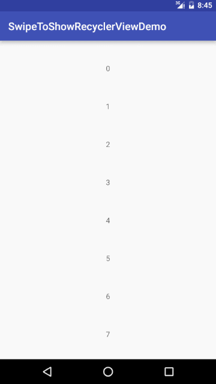

# SwipeToShowRecyclerView / SwipeMenuRecyclerView

An Android Library to add a hidden menu for each item in a [RecyclerView](https://developer.android.com/reference/android/support/v7/recyclerview/package-summary.html)




[  ](https://bintray.com/ghostish/maven/SwipeToShowRecyclerView/_latestVersion)

# Features

1. support mutliple menu items
2. support binding different menu to each itemview according to its viewtype
3. overscroll effect
4. easy to use

# Requirement

1. minSdkVersion 17

# How to Use

1. add the following script to your build.gradle
   >compile 'com.ghostish.androidlearning:swipetoshowrecyclerview:1.0.1'
 
2. extends `SwipeMenuItemAdapter` as your RecyclerView adapter, overide its method as usual 
(eg: onBindViewHolder(), getItemCount() ... etc)

3. overide the following methods:

        /*you must return your itemview according to the given viewtype in this method*/
        publc View onPrepareViewHolder(ViewGroup parent, int viewType);

        /*return the viewholder created for your itemview, usually just simply return your viewHolder instance*/ 
        public VH onCreateViewHolder(View container);

        /*return the MenuItemBean array which describe your menu according to the given viewtype.
        * Each MenuItemBean have a label and a color related to each menu item 
        */
        public MenuItemBean[] getMenuContent(int viewType);

        /*handle menu items' onClick event here, should always call super method first*/
        public void onMenuItemClick(RecyclerView.ViewHolder holder, int labelPosition, String labels); 

4. use `SwipeToShowRecyclerView` as the RecyclerView in your layout file, pass it your `SwipeMenuItemAdapter` instance
as its Adapter, and set up the LinearLayoutManager

# Simple Examples:
```java
        public class SwipeMenuItemImpl extends SwipeMenuItemAdapter<SwipeMenuItemImpl.ViewHolder> {
        private List<Bean> mData;
        private static final int TYPE_TOP = 11;
        private static final int TYPE_NO_DELETE = 12;
        private static final int TYPE_NORMAL = 13;
        @Override
        public View onPrepareViewHolder(ViewGroup parent, int viewType) {
            return LayoutInflater.from(parent.getContext()).inflate(R.layout.swipe_item_layout, parent, false);
    
        }
        @Override
        public ViewHolder onCreateViewHolder(View container) {
            return new ViewHolder(container);
        }
    
        @Override
        public void onMenuItemClick(RecyclerView.ViewHolder viewHolder, int labelPosition, String labels) {
            super.onMenuItemClick(viewHolder, labelPosition, labels);
            switch (labels) {
                case "Top": {
                    Bean bean = mData.remove(viewHolder.getAdapterPosition());
                    mData.add(0, bean);
                    notifyItemRangeChanged(0, mData.size());
                    break;
                }
                case "Mark as Unread": {
                    Bean bean = mData.get(viewHolder.getAdapterPosition());
                    bean.setRead(false);
                    notifyItemChanged(viewHolder.getAdapterPosition());
                    break;
                }
    
                case "Delete":
                    mData.remove(viewHolder.getAdapterPosition());
                    notifyItemRemoved(viewHolder.getAdapterPosition());
                    break;
            }
        }
    
        @Override
        public SwipeMenuItemAdapter.MenuItemBean[] getMenuContent(int viewType) {
            MenuItemBean[] beans = null;
            switch (viewType) {
                case TYPE_TOP:
                    beans = new MenuItemBean[]{new MenuItemBean("Mark as Unread", Color.parseColor("#FFB7B2B4")), new MenuItemBean("Delete", Color.RED)};
                    break;
                case TYPE_NORMAL:
                    beans = new MenuItemBean[]{new MenuItemBean("Top", Color.parseColor("#FFFF8C40")), new MenuItemBean("Mark as Unread",     Color.parseColor("#FFB7B2B4")), new MenuItemBean("Delete", Color.RED)};
                    break;
                case TYPE_NO_DELETE:
                    beans = new MenuItemBean[]{new MenuItemBean("Top", Color.parseColor("#FFFF8C40")), new MenuItemBean("Mark as Unread",     Color.parseColor("#FFB7B2B4"))};
                    break;
            }
            return beans;
        }
        
        ......
    }
```
 --------------------------------------
```java
     Acticity code: 
     protected void onCreate(@Nullable Bundle savedInstanceState) {
        super.onCreate(savedInstanceState);
        setContentView(R.layout.activity_recycler_view);
        final SwipeToShowRecyclerView rv = (SwipeToShowRecyclerView) findViewById(R.id.recycler_view);
        List<SwipeMenuItemImpl.Bean> data = new ArrayList<>();
        for (int i = 0; i < 20; i++) {
            data.add(new SwipeMenuItemImpl.Bean(String.valueOf(i), true));
        }
        SwipeMenuItemImpl adapter = new SwipeMenuItemImpl(this, rv, data);
        rv.setLayoutManager(new LinearLayoutManager(this));
        rv.setHasFixedSize(true);
        rv.setAdapter(adapter);
    }

```

# License

   Copyright 2016 Kangel Zenn

   Licensed under the Apache License, Version 2.0 (the "License");
   you may not use this file except in compliance with the License.
   You may obtain a copy of the License at

       http://www.apache.org/licenses/LICENSE-2.0

   Unless required by applicable law or agreed to in writing, software
   distributed under the License is distributed on an "AS IS" BASIS,
   WITHOUT WARRANTIES OR CONDITIONS OF ANY KIND, either express or implied.
   See the License for the specific language governing permissions and
   limitations under the License.
